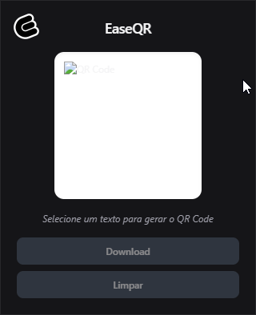
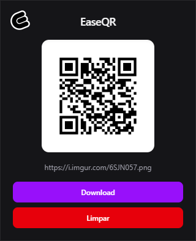

<p align="center">
  
</p>

<h1 align="center"> EaseQR </h1>

<p align="center">
  
  
  
  
</p>

Uma extensão para o Google Chrome que transforma qualquer texto selecionado em um QR Code instantaneamente.

Simples, rápida e pensada pra não atrapalhar seu fluxo.

## Sobre o projeto

O **EaseQR** nasceu como um projeto de estudo com o objetivo de explorar o desenvolvimento de extensões para o Chrome utilizando **TypeScript**, **Vite** e **TailwindCSS**.

A ideia é bem direta:

> Selecionou um texto → botão direito → gerar QR → pronto.

Sem fricção, sem tela desnecessária, sem complicação.

## Funcionalidades

- Gerar QR Code a partir de texto selecionado
- Integração com menu de contexto (clique direito)
- Download do QR Code em PNG
- Limpeza rápida do estado
- Interface moderna com TailwindCSS
- Armazenamento usando `chrome.storage`

## Tecnologias utilizadas

- **TypeScript**
- **Vite**
- **TailwindCSS**
- **Chrome Extension API (Manifest V3)**
- **QRCode (lib)**

## Preview

<p align="center">
  
  
</p>

## Como rodar localmente

```bash
# instalar dependências
npm install

# build da extensão
npm run build
```

Depois:

1. Acesse `chrome://extensions`
2. Ative o **Modo desenvolvedor**
3. Clique em **"Carregar sem compactação"**
4. Selecione a pasta `dist`

## Como usar

1. Selecione qualquer texto em uma página
2. Clique com o botão direito
3. Clique em **"Gerar QR Code"**
4. Abra a extensão
5. Faça o download ou limpe os dados

## Licença

Este projeto está sob a licença MIT.
